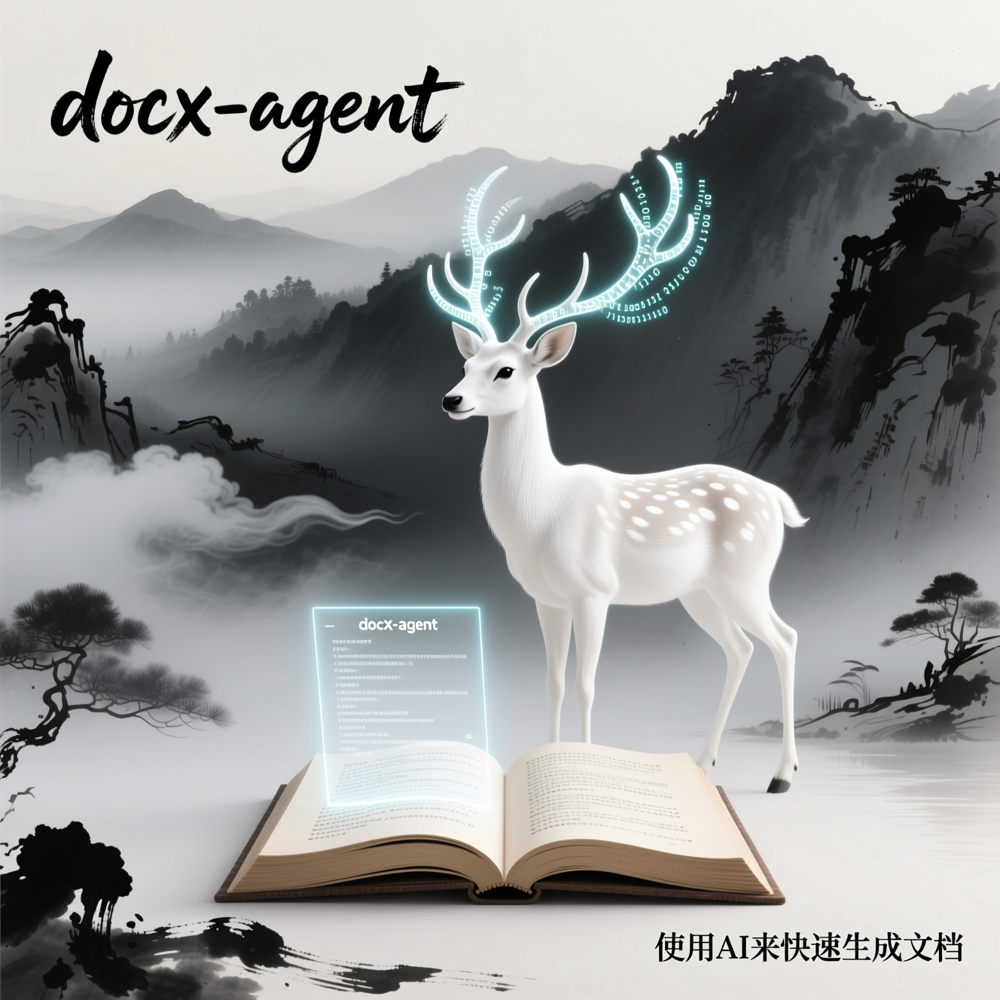

# <p align="center">Docx-agent</p>

<p align="center"></p>

[](LICENSE) 


Docx-agent 旨在在 Go 生态里把 Word（.docx）文档“结构化”为干净可用的 JSON，并与各类大模型进行“JSON 化对接”（如基于 JSON Schema 的强约束输出、字段补全与纠错）。项目底层解析能力直接来源于并基于 Godocx 的源码进行扩展，在此基础上补充了文档结构抽象、JSON 正规化、Schema 校验与 AI 适配层。

- 解析 .docx → 结构化中间层 → 标准化 JSON
- 可选：调用大模型生成/补全/纠错，并强制输出符合 JSON Schema 的结构
- 面向工程：易于落地到工作流、API 或微服务

- 仓库名：github.com/iEvan-lhr/docx-agent
- 包名：docxai 或 docxaijson

---

## 为什么不是 Fork，而是新仓库

本项目与上游 gomutex/godocx 的定位和演进路径存在明显差异，为避免对上游造成干扰并保持我们在 AI/JSON 方向的快速演进，选择以新仓库形式发布：

1. 定位不同：上游是“Docx 读写库”，本项目是“Docx→结构化 JSON→AI 对接”的工程化方案，API、模块划分、依赖范围差异较大。
2. 依赖边界：本项目引入了 AI SDK、JSON Schema、流式处理等与上游无关的依赖，不适合作为 fork 挂在上游 issue/PR 流程里演进。
3. 版本策略：我们需要频繁迭代实验性能力（如不同厂商的结构化输出适配），独立语义版本更合适。
4. 代码组织：在保留上游版权声明和许可的前提下，对解析层做了重构与抽象，文件结构与包边界与上游差异较大。
5. 维护成本：保持与上游解耦，便于在 AI 场景下专注问题反馈与长期维护。

---

## 与上游的关系与致谢

- 解析 .docx 的底层能力来自并基于：gomutex/godocx（MIT）
 - 项目地址：https://github.com/gomutex/godocx
 - 文档：https://gomutex.github.io/godocx / https://pkg.go.dev/github.com/gomutex/godocx
- 许可与归属：本项目保留并遵循 Godocx 的 MIT 授权，在源码中保留原版权与许可声明；请同时查阅本仓库的 LICENSE 与 THIRD-PARTY-NOTICES/CREDITS。
- 部分新的功能以及解析将会通过fork分支提交给Godocx仓库。

Godocx 对本项目至关重要，特此致谢。

---

## 功能特性

- 文档结构抽象：段落、标题、列表、表格、图片等解析为统一的结构树 (开发中)
- 标准化 JSON：提供默认 JSON 模型与可配置映射，适配你的下游业务字段 (开发中)
- JSON Schema 支持：定义、校验、纠错与自动补全 (开发中)
- AI 结构化对接： (开发中)
 - 支持主流大模型的“JSON/Schema 强约束输出”模式 (开发中)
 - 可将文档内容转成提示词再约束输出 JSON (开发中)
 - 支持安全回退：不合规 JSON 会自动校验并重试/纠偏 (开发中)
- 可扩展的 Provider 接口：便于接入不同厂商（OpenAI、Azure OpenAI、Anthropic、DeepSeek 等） (开发中)
- 生产友好：上下文可控、可观测、可注入日志与指标 (开发中)

---

## 安装

请将模块路径替换为你的真实仓库路径。

```bash
go get github.com/iEvan-lhr/docx-agent
```

Go 版本要求：1.24+（建议 1.24.4+）

---

## 快速上手

下面示例展示“解析 .docx → 标准化 JSON”，以及“在 JSON Schema 约束下与 AI 交互”。API 以说明为主，实际名称以仓库代码为准。


---

## JSON 输出示例


---

## 与 Godocx 的差异

- 聚焦“结构化 JSON 与 AI 对接”，而非通用的 Docx 读写
- 提供文档结构抽象与 JSON Schema 管理层
- 内置/可插拔 AI Provider 适配与强约束 JSON 输出
- 更偏工程化的容错、校验与流水线编排能力

如需 Docx 的通用读写与格式化操作，建议直接使用上游 Godocx。

---

## Roadmap

- 更多版式与对象的解析（页眉/页脚、脚注、形状等）
- 更丰富的默认 JSON 模型与映射 DSL
- 多厂商结构化输出能力对齐与评测
- CLI/HTTP 服务化形态（可选）
- 更强的表格语义恢复（合并单元格、标题行识别等）

---

## 贡献

- 提 Issue 时请附上最小可复现样例（建议脱敏的 .docx）
- 欢迎就 AI Provider 适配、JSON Schema 模型设计提出建议
- 提交 PR 前请运行单元测试与 linters

---

## 许可与版权

- 本项目采用 MIT 许可证，详见 LICENSE
- 本项目包含并基于 gomutex/godocx 的源码开发，遵循其 MIT 许可，并在源码中保留原版权与许可声明
- 详见 THIRD-PARTY-NOTICES/CREDITS

---

## 致谢

- gomutex/godocx（核心 Docx 解析能力）
- 以及所有对 JSON 结构化与 AI 对接提供建议的贡献者

如果你正在把 Word 文档流程“上 AI”，希望这个库能让“结构化”这一步变得简单、稳定、可控。